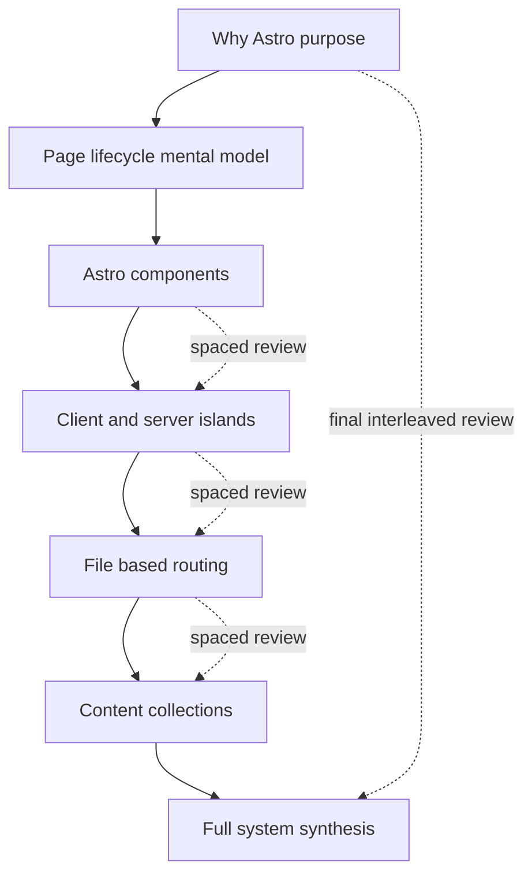

# Audio-First Astro.js Script Plan

**Overview:** Create an audio-first Astro.js teaching series under `audicode/astro/`, sourced from official Astro docs—not this repo—using top-down conceptual teaching, concept-by-concept code narration, section recaps, and spaced-repetition reviews.

## Goal

Produce narratable teaching scripts for Astro that work with eyes closed (headphones / podcast / YouTube background listening). Understanding must come from spoken explanation of purpose, mental models, moving parts, and usage—not from seeing code on screen.

**Default scope for first delivery:** create `audicode/astro/` (this folder), write a **methodology guide**, a **series curriculum map**, and a **complete Episode 1 script** (~45–75 min spoken). Later episodes are outlined only; full scripts can follow the same pattern.

**Source of truth (explicit):** [docs.astro.build](https://docs.astro.build/) and related official Astro materials. Do **not** base content on `astro-wiki/`, `github-todos/`, or other repo projects. Cite docs URLs in research notes; keep spoken script free of “as of this repo” framing.

---

## Pedagogical ideas (how to make this work audio-only)

Your constraints are the core. These additions make them reliable in practice:

### 1. Speak in layers, never in files
For every topic use the same ladder:
1. **Why it exists** (problem / job)
2. **Mental model** (analogy + what “lives where”)
3. **Moving parts** (named pieces and relationships)
4. **How you use it** (decision rules + typical workflow)
5. **Common mistakes** (what people confuse)
6. **Checkpoint recap** (high-level only)

### 2. Ban “line-by-line walkthrough” mode
When API/code must be mentioned:
- Name the **library/function** and its **job** (“`getCollection` asks Astro for every entry in a named collection”)
- Describe **local logic as an algorithm** (“for each post, build a route object with a params id and pass the entry as props”)
- Prefer **one idea per sentence**; pause; then next function
- Never say “next line” / “look at this” / “as you can see”

### 3. Audio-native mnemonic devices
- **Spatial metaphors:** sea of HTML vs client islands vs server islands
- **Timeline stories:** build-time → request-time → browser hydrate
- **Contrast pairs:** SPA vs MPA; prerender vs on-demand; client island vs server island
- **Decision trees spoken aloud:** “If the UI needs clicks and state in the browser, reach for a client directive. If it only needs personalized HTML and no interactivity, reach for `server:defer`.”

### 4. Section endcaps + spaced repetition
- **End of each major section:** 60–90 second high-level recap (purpose + 3–5 bullets spoken as sentences)
- **Spaced reviews:** after introducing a new related topic, insert a 20–40 second “remember earlier…” that re-asks a prior detail (e.g. after content routes, re-probe `getStaticPaths` + islands)
- **Pattern:** introduce → use lightly → recap → later re-test with a new scenario
- Tag review beats in the script as `[REVIEW: topic]` so recording/editing stays intentional

### 5. Spoken formatting conventions (write for the ear)
- Spell out symbols when needed once, then use spoken names: “client colon load” → thereafter “the client-load directive”
- Prefer “file under source pages” over path dumps; if a path is essential, say it slowly once and immediately say what role that folder plays
- Use **signposting**: “Part two of three…”, “Before we go deeper…”, “Hold that idea—we’ll use it in routing”
- Target ~130–150 wpm; mark `[PAUSE]` at model shifts
- Optional cold-open hook (problem story) then syllabus map so listeners know the journey

### 6. What the YouTube video can show (optional, non-required)
Visuals may exist for retention, but script must stand alone. Prefer diagrams of architecture, not code panes. If code appears on screen, narration still explains concepts as if the screen is blank.

### 7. Companion notes (not a dependency)
A short “cheat sheet” markdown for listeners who later want names/links is fine; the audio must not require it.

---

## Deliverables in `audicode/astro/`

```
audicode/astro/
  README.md                 # series intent, how to use scripts, listening tips
  METHODOLOGY.md            # audio-first rules + review system + code-narration rules
  CURRICULUM.md             # episode map, learning outcomes, docs source links
  research/
    sources.md              # canonical docs URLs + version notes (Astro 5/current)
  ep01-foundations/
    SCRIPT.md               # full narratable script
    OUTLINE.md              # section map + review beat schedule
    CHEATSHEET.md           # optional post-listen names/APIs (not required to follow)
```

---

## Curriculum map (docs-driven)

### Episode 1 — Foundations (write fully now)
**Outcomes:** listener can explain what Astro is for, why zero-JS-by-default matters, how `.astro` components work, islands vs static HTML, file-based routing basics, and the idea of content collections—without writing code from memory.

| Section | Docs anchors | Teaching focus |
|---|---|---|
| A. Why Astro exists | [Why Astro?](https://docs.astro.build/en/concepts/why-astro/) | Content-driven sites; 5 design principles; SPA vs server-first MPA tradeoffs |
| B. Mental model of a request/page | Islands + components guides | Build-time HTML vs request-time HTML vs browser JS |
| C. Astro components | [Components](https://docs.astro.build/en/basics/astro-components/) | Fence (script) vs template; props; slots; no client runtime by default |
| D. Islands architecture | [Islands](https://docs.astro.build/en/concepts/islands/) | Client islands vs server islands; selective hydration |
| E. Client directives (concept use) | Directives reference | `client:load` / `idle` / `visible` / `media` / `only` as *when* JS loads |
| F. Routing basics | [Routing](https://docs.astro.build/en/guides/routing/) | `src/pages` → URLs; static vs dynamic params; role of `getStaticPaths` |
| G. Content collections intro | [Content collections](https://docs.astro.build/en/guides/content-collections/) | Why collections; schema/validation; `getCollection` / `getEntry` jobs |
| H. Closing synthesis | — | Full-system story: content → routes → static shell → islands |

**Spaced-repetition schedule inside Ep1 (examples):**
- After C: review “server-first / zero JS default”
- After D: review component fence vs template
- After E: review client vs server island decision rule
- After F: review islands (how a page of mostly static HTML still hosts interactive widgets)
- After G: review `getStaticPaths` purpose when generating post pages from collections
- Final: interleaved quiz-style recap of all major concepts

### Episode 2 — Building pages & styling (outline only)
Layouts, styling approaches, images/assets, Markdown/MDX pages, project structure mental model.

### Episode 3 — Content system in depth (outline only)
Content Layer / loaders, schemas, querying, generating routes from collections, live vs build-time content concepts per current docs.

### Episode 4 — On-demand rendering & adapters (outline only)
Prerender default vs `prerender = false`; adapters; hybrid mental model; endpoints; middleware at a conceptual level.

### Episode 5 — Interactivity & polish (outline only)
Framework components as islands, view transitions conceptually, actions/sessions at high level, integrations as extension points.

---

## Script format for `SCRIPT.md`

Use a recorder-friendly structure:

```markdown
# Episode 1 — Astro Foundations (Audio Script)
**Target runtime:** ~60 min
**Sources:** docs.astro.build (listed in research/sources.md)

## Cold open
...

## Section A — Why Astro exists
### Teaching beat
...
### Concept breakdown
...
### How you use this idea
...
### [RECAP — high level]
...
### [REVIEW — earlier: n/a]

## Section B — ...
```

Rules baked into each section template:
- No fenced code blocks meant to be read aloud as code
- If an API is essential: **Spoken API card** — name, purpose, inputs/outputs in plain language, one usage scenario
- Mark `[REVIEW: …]` and `[RECAP]` explicitly
- End with a **listener self-check** (3 spoken questions, then answers)

---

## Research workflow (before/while writing)

1. Pull current official pages for each Ep1 topic (Why Astro, Islands, Components, Routing, Content collections, Directives, On-demand rendering overview for accurate defaults).
2. Record version-sensitive notes in `research/sources.md` (e.g. Content Layer / `src/content.config.ts`, `server:defer`, client directives).
3. Prefer official wording for definitions; rewrite for spoken clarity; do not invent APIs.
4. When secondary blogs help analogies, keep facts checked against docs.

---

## Quality bar before calling Episode 1 done

- Blind listen test: read script aloud; note any moment that requires “seeing” something → rewrite
- Every major section has a recap
- At least **6 spaced review beats** reusing earlier details in new contexts
- Code mentions only via spoken API cards / algorithm narration
- No dependence on this repository’s Astro apps

---

## Implementation sequence (after plan approval)

1. Create `audicode/astro/` structure + README/METHODOLOGY/CURRICULUM/research stubs
2. Research and lock Ep1 source list from official docs
3. Write `ep01-foundations/OUTLINE.md` with review beat map
4. Write full `ep01-foundations/SCRIPT.md`
5. Add short `CHEATSHEET.md` + series README listening instructions
6. Commit / PR as usual



---

## Implementation todos

- [ ] Create `audicode/astro/` with README, METHODOLOGY.md, CURRICULUM.md, research/sources.md
- [ ] Lock Episode 1 source list from official Astro docs (Why Astro, components, islands, directives, routing, content collections)
- [ ] Write ep01-foundations/OUTLINE.md with section map and spaced-repetition review beats
- [ ] Write full audio-narratable ep01-foundations/SCRIPT.md per methodology rules
- [ ] Add optional CHEATSHEET.md for post-listen API names/links (not required to follow audio)
